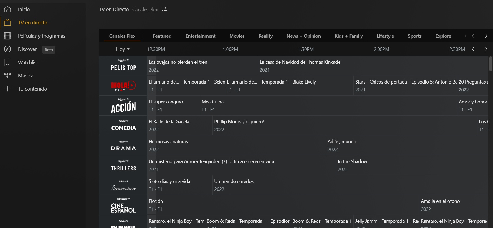
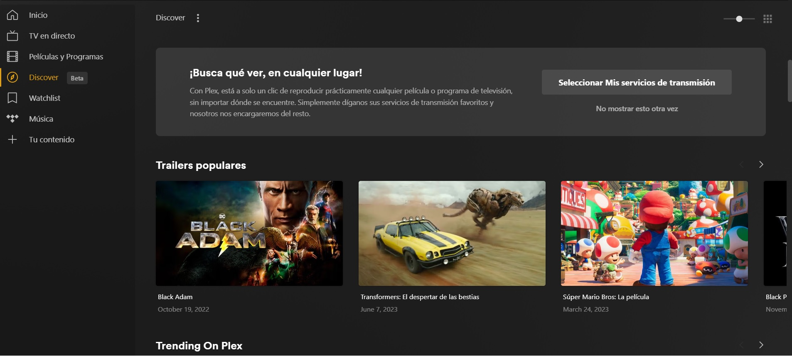
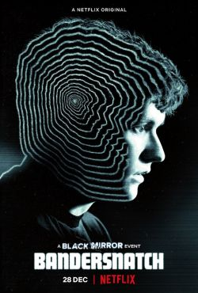

# PEC3: Visionando el futuro con las gafas de Manovich 

Autor: Francisco Garrido Vecina

Fecha: Diciembre 2022

## Introducción

> A mediados de la década de los noventa asistimos a una transformación fundamental en la cultura de la imagen en movimiento. Los medios de comunicación por separado ―películas cinematográficas, gráficos, fotografía, animación, animación 3D por ordenador y la tipografía― comenzaron a combinarse de mil maneras. De este modo, finalizando la década, el medio "puro" de las imágenes en movimiento se volvió una excepción y los medios híbridos, la norma. - [Manuel Bayonas](https://ticsarteyeducacion.files.wordpress.com/2018/09/a-6-manovich-lev-comprender-los-medios-hicc81bridos-traducciocc81n-de-la-cacc81tedra-de-analisis-y-cricc81tica.pdf)

Debido a la aparición de múltiples medios de comunicación, empezaron a combinarse de cuantiosas maneras. En vez de llegar a la fusión lógica de estos medios, se produjeron nuevos medios híbridos que relacionaban los múltiples medios de comunicación.

En este punto debemos de diferenciar varios conceptos.
- Remediación. Es un proceso por el cual un nuevo medio se apropia de algo (técnicas, formas o significación social) de otro medio.
- Multimedia. Cada programa explota un tipo de objeto, teniendo una experiencia por separado de cada uno de ellos.
- Hibridación. Agrupan antiguas técnicas para dar una nueva experiencia.
> Este mecanismo es la hibridación. Se agrupan técnicas y formatos de representación de medios físicos y electrónicos anteriores, y las nuevas técnicas de manipulación de la información y formatos de datos exclusivos del ordenador para formar nuevas combinaciones. - Manovich (2013)

Las películas digitales fue la __remediación__ de las películas grabadas de manera convencional con cámara de vídeo de principio a fin. Para poder reproducir esta película digital necesitamos un reproductor, este reproductor es mi ejemplo de __multimedia__. Cuando hay una manipulación de esta película, cómo por ejemplo en la película BanderSnatch (de Black Mirror), se consigue la __hibridación__.

## Re-descubriendo la hibridación: Plex

Plex pretende ser el mejor __centro multimedia__ ya que podemos realizar transmisiones en directo, tanto de nuestros propios archivos como de canales en directo, entre sus muchas funcionalidades. De este modo hay una remediación de la televisión y la forma de reproducir nuestra propia biblioteca de medios.

Podemos usar Plex para realizar __streaming__ entre sus más de 200 canales disponibles, sus más de 50.000 títulos (entre series y películas) y un catálogo de música bastante decente. Todo es configurable, podemos filtrar los canales por diversos criterios cómo pueden ser deportes o familia y las películas bajo demanda tiene una larga lista de categorías. De esta manera Plex consigue ser __un programa híbrido__ a través del streaming.

> Tan pronto como se inventan, estos nuevos elementos empiezan a interaccionar con los ya existentes. Los procesos de invención e hibridación, por tanto, están muy relacionados y operan de forma conjunta. - Manovich (2013)

También podemos montar nuestro propio centro __multimedia cliente-servidor__ con nuestros propios archivos de películas, series, música y hasta fotos. Agrupando los distintos formatos de mkv, avi, mp4, divx, mp3, jpg, png, tiff, etc y teniendo como resultado poder tratar esa información a través de una misma plataforma. Para poder reproducirlo desde cualquier sitio. Además permite compartir parte o completamente tu biblioteca con amig@s, de esta forma puedes tener una biblioteca bastante grande. De esta manera conseguimos la distribución de audio y/o vídeo desde nuestro servidor a cualquier dispositivo, siendo otro claro ejemplo de __hibridación__.

> los híbridos pueden centrarse en nuevas maneras de navegar e interaccionar con formatos de medios ya existentes. En este caso el tipo de medio en sí ni se modifica ni se combina con otros, sino que la hibridación se produce en la interfaz de usuario y las herramientas que facilita el proyecto, servicio o aplicación para trabajar con ese tipo de medios. - Manovich (2013)

Recientemente esta compañía norteamericana ha sacado la opción de "Descubrir". Con la que podemos ver los próximos estrenos tanto de películas y series, tanto de cines como de plataformas de pago, totalmente configurable para que te aparezcan resultados entre una o varias plataformas. De esta forma se consigue la hibridación por la __unión de medios distintos__.

> Desde esta perspectiva, la nueva especie de medios (un único proyecto, servicio web o programa de software) representa el encuentro de diversas técnicas que anteriormente pertenecían a medios distintos. - Manovich (2013)

Y todo esto sin ningún tipo de registro, con la excepción evidente de realizar broadcasting, ya que tenemos que tener un servidor disponible. Podemos explotar este centro multimedia desde Amazon Appstore, Android, Apple TV, Android TV, Chromecast, Roku, iOS, PlayStation, Sonos, Oculus Go, webOS, Tizen, Windows, Xbox, and macOS.

Actualmente soy consumidor de este impresionante centro multimedia. Tengo instalado mi servidor en una máquina virtual y cuando quiero disfrutar de mi película o serie favorita desde cualquier sitio, sólo tengo que arrancar mi PC. Plex ha tenido una buena evolución, arreglando fallos e incorporando mejoras, incluyendo un buen servicio técnico. Todavía quedan mejoras pendientes con este software, cómo por ejemplo la nueva opción de descubrir, a día de hoy sólo te enlaza a la página del proveedor. Estoy esperando que mejoren esta opción para que en vez de enlazar a la página del proveedor, se reproduzca en el mismo Plex. No tengo ninguna duda que disfrutaré de esta mejora y las muchas que quedan por venir, con mi modesto servidor Plex.

## Re-descubriendo la hibridación: Black Mirror: Bandersnatch

Black Mirror: Bandersnatch es una película que interactúa con el espectador dejando que elija algunas decisiones, dichas decisiones se pueden entrelazar para llegar hasta cinco finales posibles según Netflix, según el productor hay entre diez y doce finales. 

Fue estrenada en 2018 y tiene un promedio de 90 minutos, aunque se filmaron 300 minutos. Black Mirror: Bandersnatch obtuvo 12 nominaciones en diversos certámenes, de las cuales ganó 5.

La película Black Mirror: Bandersnatch interactúa con el espectador cuando en diversos momentos deja alrededor de 10 segundos para que elijamos un opción entre las posibles, cada una de esas opciones te llevará por un desarrollo distinto en la película y después continuamos eligiendo, pudiendo deshacer la última elección. El hecho de que el espectador pueda elegir el argumento de la película, es un claro ejemplo de __hibridación__, ya que no tiene sentido el vídeo por un lado y el texto por otro lado. La cuestión de que el espectador elija una opción y transparentemente al usuario, se reproduzca por ejemplo del minuto 10 al 20, el ir enlazando todas estas partes de películas a un texto, demuestra la modularidad que explica Manovich.

> La hidridación una fusión entre elementos que comparten técnicas de software e interfaces generando una experiencia nueva y coherente, diferente a la experimentación de los elementos por separado - (Adell, 2014)

> Esta modularidad es comparable con el principio fundamental de la creación de software moderno a la hora de diseñar programas informáticos a partir de pequeños componentes reutilizables llamados funciones o procedimientos. - Manovich (2013)

¿Qué tipo de hibridación encontramos en Black Mirror: Bandersnatch? Se centra en nuevas formas de navegar en la película, a través de la interacción con el espectador, usando medios existentes. Estos medios existentes ni se modifican ni se fusionan, la hibridación se consigue en la interfaz de usuario donde interacciona con el espectador.

¿No habéis querido cambiar alguna decisión en el argumento de tu película favorita? Con Black Mirror: Bandersnatch lo conseguimos. En mi opinión echo en falta más poder de decisión, ya que en algunos momentos nos puede dar la sensación de ser un poco repetitivos y que reutilizan muchas escenas entre las distintas decisiones que tenemos que tomar. Aún así es una gran película que podemos ver varias veces con experiencias distintas. Cuando se estrenó esta película, quizás la ví tres o cuatro veces. Supongo que toda persona que ve esta película, vuelve a verla con distintas decisiones, ¿con qué otros tipos de películas puedes decir esto?.
¿Cuál es el siguiente paso en la hibridación de las películas interactivas? Podría ser un software que fuera generando una película por IA en función de la elecciones del espectador.

### Referencias y Bibliografía

* Manovich, Lev. (2013). **El Software toma el mando**. Barcelona: Editorial UOC. 
* Manuel Bayonas. (2008). **Comprender los medios híbridos** . [consulta: 16 diciembre 2022]. Disponible en: https://ticsarteyeducacion.files.wordpress.com/2018/09/a-6-manovich-lev-comprender-los-medios-hicc81bridos-traducciocc81n-de-la-cacc81tedra-de-analisis-y-cricc81tica.pdf 
* Plex. [consulta: 16 diciembre 2022]. Disponible en: https://www.plex.tv/es/
* Wikipedia, 2022. **Plex_(company)**. [consulta: 16 diciembre 2022]. Disponible en: https://en.wikipedia.org/wiki/Plex_(company)
* Wikipedia, 2022. **Black_Mirror:_Bandersnatch**. [consulta: 16 diciembre 2022]. Disponible en: https://en.wikipedia.org/wiki/Black_Mirror:_Bandersnatch
* Adell, F. (2014). **Remediación, multimedia e hibridación de los medios**. Blog de la asignatura Fundamentos y evolución de la multimedia del Grado de Multimedia, Universitat Oberta de Catalunya. http://multimedia.uoc.edu/blogs/fem/es/remediacio-multimedia-i-hibridacio-dels-mitjans/
